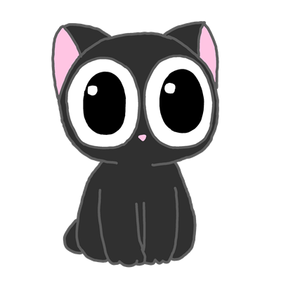
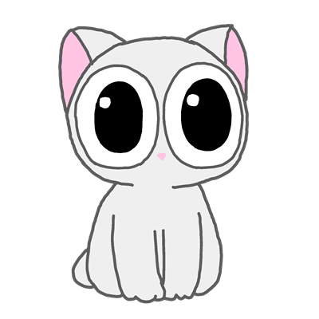
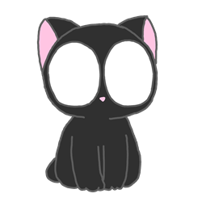
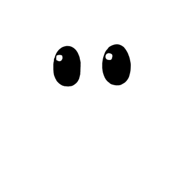

<p align="center">
  
  &nbsp;&nbsp;
  
</p>

<h1 align="center">cocoBar</h1>

<p align="center">
  A cute desktop companion cat for Windows 🐱
</p>

<p align="center">
  
  
  
</p>

---

## What is cocoBar?

**cocoBar** is a tiny cat that lives on your desktop. Its eyes follow your mouse, it blinks naturally, and you can double-click it to set reminders, write notes, or manage a to-do list. It lives in your system tray and stays out of your way.

**No installer. No browser. No bloat.** Just one small `.exe` file.

<p align="center">
  
  &nbsp;&nbsp;&nbsp;
  
</p>

---

## Download & Run (Easy)

### Step 1: Download

1. Click the green **Code** button at the top of this page
2. Click **Download ZIP**
3. Extract the ZIP anywhere on your computer (e.g. `Desktop\cocoBar`)

### Step 2: Run

1. Open the extracted folder
2. Go into `target\release\`
3. Double-click **`cocobar.exe`**
4. A cat appears on your desktop! That's it.

> **Tip:** The cat starts near the bottom-right of your screen. You can move it, resize it, and change its color.

### Step 3: Create a Desktop Shortcut (Optional)

1. Right-click the cat (or the tray icon in the bottom-right corner)
2. Click **"Add shortcut to Desktop"**
3. A shortcut with the cat icon appears on your desktop

---

## How to Use

| What you want to do | How to do it |
|---|---|
| **Move the cat** | Press `Ctrl+Alt+D`, then drag the cat with your mouse. Press `Ctrl+Alt+D` again to stop moving. |
| **Resize the cat** | Scroll your mouse wheel up/down over the cat, or use the slider in the menu |
| **Open the menu** | Double-click or right-click on the cat |
| **Switch color** | Open the menu and click Black/White, or press `Ctrl+Alt+B` / `Ctrl+Alt+W` |
| **Set a reminder** | Open the menu → Reminders tab → type a message and time (e.g. `14:30`) → click "Set Reminder" |
| **Write a note** | Open the menu → Notes tab → type your note → click "Save Note" |
| **Manage tasks** | Open the menu → To-do tab → type a task → click "Add" |
| **Start with Windows** | Right-click the tray icon → check "Start with Windows" |
| **Quit** | Right-click the tray icon → Exit |

### Keyboard Shortcuts

All shortcuts use **Ctrl+Alt**:

| Key | Action |
|---|---|
| `B` | Switch to black cat |
| `W` | Switch to white cat |
| `1` | Small size (320px) |
| `2` | Medium size (520px) |
| `3` | Large size (760px) |
| `D` | Toggle move mode (drag the cat) |

---

## Features

- **Eye tracking** — pupils follow your mouse with smooth animation and idle wander
- **Natural blinking** — random blink cycle every 3-7.5 seconds
- **Black & White** — two cute color variants
- **Smooth resize** — 100px to 760px with slider or scroll wheel
- **Reminders** — timed notifications that pop up as tray balloons
- **Quick Notes** — persistent notepad that saves between sessions
- **To-do List** — add, complete, and remove tasks
- **System tray** — lives quietly in your taskbar
- **Desktop shortcut** — one-click setup with a cat icon
- **Auto-save** — remembers everything (position, color, notes, tasks)

---

## For Developers: Build from Source

### Prerequisites

1. **Rust** — Install from [rustup.rs](https://rustup.rs) (choose `x86_64-pc-windows-gnu`)
2. **MSYS2** — Install from [msys2.org](https://www.msys2.org), then install the ucrt64 toolchain:
   ```
   pacman -S mingw-w64-ucrt-x86_64-gcc
   ```

### Build

```powershell
# Set up PATH (run each time you open a new terminal)
$env:PATH = "C:\msys64\ucrt64\bin;$env:PATH;$env:USERPROFILE\.cargo\bin"

# Clone and build
git clone https://github.com/phon-t/CocoBar.git
cd CocoBar
cargo build --release
```

The built executable is at `target/release/cocobar.exe`.

> **Note:** Stop the running exe before rebuilding:
> ```powershell
> Get-Process -Name cocobar | Stop-Process -Force
> ```

---

## How It Works

cocoBar is a single-file Rust application (~1900 lines) that talks directly to Windows via Win32 API. No frameworks, no Electron, no web tech.

- **Rendering:** 60 FPS compositing loop using `UpdateLayeredWindow` with a 32-bit DIB
- **Layers:** 4 PNG layers composited per frame (body, eyes, highlights, blink)
- **Eye tracking:** Cursor position mapped to pupil offset with smooth lerp interpolation
- **Menu:** Custom tabbed popup window built with raw Win32 controls
- **Assets:** All PNG images embedded at compile time via `include_bytes!`

---

## Data Storage

All your data is saved in `%APPDATA%\cocoBar\`:

| File | Contents |
|---|---|
| `config.txt` | Color, size, window position |
| `mydata.txt` | Reminders, notes, to-do items |
| `cat.ico` | Generated icon for shortcuts |

---

## License

[MIT](LICENSE)
