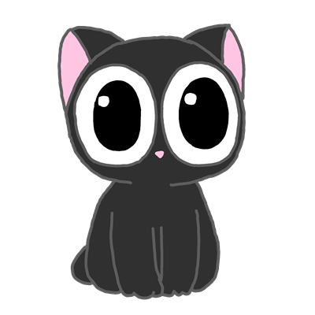
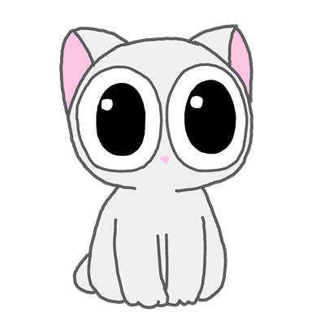

<p align="center">
  
  &nbsp;&nbsp;
  
</p>

<h1 align="center">cocoBar</h1>

<p align="center">
  A cute desktop companion cat for Windows
</p>

<p align="center">
  
  
  
</p>

---

## What is cocoBar?

**cocoBar** is a tiny cat that lives on your desktop. Its eyes follow your mouse, it blinks naturally, gets annoyed when you poke it, and you can dress it up with bells, scarves, and ties. Double-click it to open a menu with a to-do list and quick notes, or leave it to quietly wander around your screen.

**No installer. No browser. No bloat.** Just one small `.exe` file.

---

## Download

### Option 1: Direct Download (Recommended)

**Click here to go to the Downloads page:**

**[>>> DOWNLOAD LATEST RELEASE <<<](https://github.com/phon-t/CocoBar/releases/latest)**

On that page:
1. Find the latest version
2. Click on **`cocobar.exe`** under "Assets"
3. The file will download to your computer

Then just **double-click `cocobar.exe`** to run. That's it!

### Option 2: Download Full Source

1. Click the green **\<\> Code** button at the top of this page
2. Click **Download ZIP**
3. Extract the ZIP anywhere
4. Follow the **Build from Source** instructions below — `target` is generated by the build

---

## How to Use

| What you want to do | How to do it |
|---|---|
| **Move the cat** | Click and hold the cat, then drag it anywhere. Let go to drop it. |
| **Resize the cat** | Scroll the mouse wheel over the cat, or open the menu > Customize > type a size (100–500 px) and click Apply. |
| **Open the menu** | Double-click or right-click on the cat |
| **Open Notes directly** | Press `Ctrl+Alt+N` from anywhere. The shortcut opens your saved-note cards, or returns to the current draft. |
| **Open To Do directly** | Press `Ctrl+Alt+T` from anywhere. |
| **Switch color** | Open the menu > Customize, or press `Ctrl+Alt+B` (black), `Ctrl+Alt+W` (white), or `Ctrl+Alt+O` (orange) |
| **Change size quickly** | Press `Ctrl+Alt+1` (small), `Ctrl+Alt+2` (medium), or `Ctrl+Alt+3` (large) |
| **Add a task** | Open the menu > To Do tab > type a task > click "Add" |
| **Complete a task** | Click the task's checkbox in the To Do tab (toggles strikethrough) |
| **Clear tasks** | Open the menu > To Do tab > click "Clear" |
| **Write a note** | Open the menu > Notes > **+ New note**. Changes autosave; click **Save Note** or press `Ctrl+S` to save immediately. |
| **Browse saved notes** | Notes appear as cards with a title, preview, and saved date/time. When there are more than three notes, the page arrows browse older cards; "Page 1 of 2" shows your current page. |
| **Browse more tasks** | When there are more than eight tasks, use the arrows below the list to change pages. Page controls stay hidden while everything fits on one page. |
| **Edit a note** | Click its card or **Edit**, then use **All notes** to return to the collection. |
| **Delete a note** | Click **Delete** on its card; **Undo delete** restores it until you create another note or close the app. |
| **Dress the cat up** | Open the menu > Customize > use the checkboxes to pick a scarf, bell, or tie. Uncheck an accessory to remove it, or use **Remove accessories**. |
| **Keep on top** | Open the menu > Settings > check **Keep cat above other windows** |
| **Desktop shortcut** | Open the menu > Settings > check **Show a desktop shortcut** (auto-created on first run) |
| **Start with Windows** | Open the menu > Settings > check **Start with Windows** |
| **Enable or disable shortcuts** | Open the menu > Settings > Keyboard shortcuts. |
| **Check for updates** | Settings > "Check for updates" — downloads and installs a newer stable GitHub release |
| **Automatic updates** | Settings > "Automatically install GitHub updates" — off by default; checks at startup and every six hours when enabled |
| **Close the menu** | Click the **×** in its top-right corner, or press `Esc`. |
| **Close the cat** | Open the menu > click **Exit**, or press `Ctrl+Alt+X` |

### Keyboard Shortcuts

All shortcuts use **Ctrl+Alt**:

| Key | Action |
|---|---|
| `B` | Switch to black cat |
| `W` | Switch to white cat |
| `O` | Switch to orange cat |
| `1` | Small size (200px) |
| `2` | Medium size (320px) |
| `3` | Large size (500px) |
| `X` | Close cocoBar completely |
| `N` | Open Notes directly |
| `T` | Open To Do directly |

---

## Features

- **Eye tracking** -- pupils follow your mouse with smooth animation and stay inside the eye socket
- **Natural blinking** -- random blink every few seconds, with cosmetics staying in place
- **Annoyed face** -- click the cat and it makes an annoyed expression
- **Drag reactions** -- a tilted pose and a hanging tail that trails your movement; sustained fast dragging triggers dizzy eyes that fade back to normal
- **Black, White and Orange** -- three color variants, switchable anytime
- **Customization** -- 5 scarves, 2 bells, 3 ties, or remove everything
- **Resize** -- typed size input (100–500 px) plus scroll-wheel stepping and hotkeys
- **To-do List** -- add with Enter, complete, delete individual tasks, and browse every task using page controls; saved between sessions
- **Note Cards** -- separate notes with title/preview cards, saved dates, creation dates in the editor, paging, edit/delete/undo, and `Ctrl+N` for a new note
- **Reliable note saving** -- autosave after a short typing pause, immediate save on close, Unicode and multiline support, and visible save/error feedback
- **System tray** -- lives quietly in your taskbar
- **Always on top** -- optional, toggleable
- **Desktop shortcut** -- auto-created on first run (cat icon), toggleable
- **Start with Windows** -- optional autostart, toggleable
- **Built-in updater** -- manual checks plus optional automatic updates (off by default), verified downloads, and rollback if a new version fails to start
- **Auto-save** -- remembers everything (position, color, size, cosmetics, notes, tasks)

---

## Data Storage

All your data is saved in `%APPDATA%\cocoBar\`:

| File | Contents |
|---|---|
| `config.txt` | Color, size, position, cosmetics, toggles |
| `mydata.txt` | To-do items and the note-card collection, including creation and saved timestamps |
| `cat.ico` | Generated icon used for shortcuts |

Notes and tasks are written to a temporary file and flushed before replacing the previous save. If a save fails, the menu keeps the draft open so you can retry with **Save Note** or `Ctrl+S`. Existing notes are imported as a card. Older versions did not store note dates, so imported cards are labeled accordingly; their next save records a saved timestamp.

Set `COCOBAR_DATA_DIR` to use a separate data folder, for example for a portable copy or isolated testing. When this is set, cocoBar skips legacy-data migration and automatic desktop-shortcut creation.

Automatic updates are off for fresh installs and older settings. Enabling the checkbox schedules the first check after 30 seconds and subsequent checks every six hours. Manual checks work with the option off. Both paths check the stable release's version, executable size, PE headers, and GitHub SHA-256 digest when provided. Notes, tasks, and settings must save successfully before restarting. The updater prepares a replacement beside the executable, swaps it atomically, and keeps the old executable as `.update-backup`; it restores that backup if the new process exits during its first three seconds. If the install directory cannot be written, the app stays open and reports the error. Turning automatic updates off cancels any pending automatic installation.

---

## For Developers: Build from Source

### Prerequisites

1. **Rust** -- Install from [rustup.rs](https://rustup.rs) (choose `x86_64-pc-windows-gnu`)
2. **MSYS2** -- Install from [msys2.org](https://www.msys2.org), then install the ucrt64 toolchain:
   ```
   pacman -S mingw-w64-ucrt-x86_64-gcc
   ```

### Build

```powershell
# Set up PATH (run each time you open a new terminal)
$env:PATH = "C:\msys64\ucrt64\bin;$env:PATH;$env:USERPROFILE\.cargo\bin"

# Clone and build
git clone https://github.com/phon-t/CocoBar.git
cd CocoBar
cargo build --release
```

The built executable is at `target/release/cocobar.exe`.

Run the persistence regression tests with `cargo test`. To exercise the actual Windows controls and capture screenshots using isolated test data, build the app and run:

```powershell
cargo build
powershell -NoProfile -ExecutionPolicy Bypass -File tests/windows-ui.ps1
```

The regression tests cover saving, note collections, animation transitions, every accessory in both poses, and tail stability. Rendered animation frames go to `target/animation-check`. The Windows checks cover card management, save failures, restart persistence, task paging, aligned checkbox controls, panel corners and close-button gaps, actual global shortcuts, drag/resize/capture handling, and GDI resource usage. Screenshots go to `target/ui-check`.

Close cocoBar using **Exit** before rebuilding so pending notes are saved. Alternatively, the UI check can close the running release normally, rebuild it, run isolated checks, and reopen it with its original data:

```powershell
.\tests\windows-ui.ps1 -Executable .\target\release\cocobar.exe -Rebuild -RestartRunningApp
```

Test update installation, cancellation, replacement failure, and startup rollback with disposable executables (including Unicode paths):

```powershell
.\tests\windows-update.ps1
# Also download and verify the real GitHub release without installing it:
.\tests\windows-update.ps1 -Live
# Include an actual manual update check in the Windows UI checks:
.\tests\windows-ui.ps1 -Executable .\target\release\cocobar.exe -Rebuild -RestartRunningApp -LiveUpdates
```

---

## How It Works

cocoBar is a Rust application that talks directly to Windows via the Win32 API. No frameworks, no Electron, no web tech.

- **Rendering:** compositing loop using `UpdateLayeredWindow` with a 32-bit DIB
- **Layers:** PNG layers composited per frame (body, eyes, highlights, blink, cosmetics), embedded at compile time via `include_bytes!`
- **Eye tracking:** cursor position mapped to pupil offset with smooth lerp and circular clamping
- **Menu:** custom popup window built with raw Win32 controls (GDI-drawn)
- **Updater:** queries the GitHub API for the latest release, then self-replaces via a PowerShell helper

---

## Contributing

Thank you for your interest! **Pull requests are not accepted at this time** while the project is in early development. Issues and feature requests are welcome — see [CONTRIBUTING.md](CONTRIBUTING.md) and [CODE_OF_CONDUCT.md](CODE_OF_CONDUCT.md) for details.

---

## License

[Custom license](LICENSE) — free for personal and educational use; **commercial use requires prior notice** (contact the author first). See [LICENSE](LICENSE) for the full terms.
